# Umich EECS 442 (Winter 2018) Homework 4

by Wenzhe Xu

Keywords: corner detector, SIFT descriptors, RANSAC, panorama

## Introduction
In this homework, feature-based homography transformation is used to stitch pair or multiple images. This report consists of two parts. Part 1 addresses stitching between a single pair of images and Part 2 addresses stitching among multiple images. Algorithms and parameters are discussed in each section. Two extra-credits problems are analyzed in the end.

## Part 1
A test set consisting of two images (`uttower_left.jpg` and `uttower_right.jpg`) is to be stitched. The procedures are reviewed in details below.
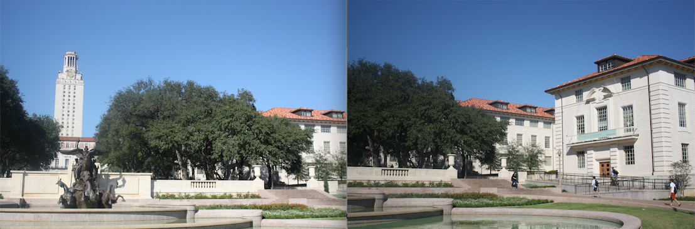

**Steps**  

1. Load both images, convert to double and to grayscale.
2. Detect feature points in both images using `harris.m` corner detector
3. Calculate descriptors for every keypoint in both images using `find_sift.m` SIFT extraction.
4. Compute feature-space distances between every pair of feature points from image A and B.
5. Select putative matches based on the distance matrix above.
6. Run RANSAC algorithm to find the model (homography transform) fitting the matches.
7. Generate the panorama and composite the two images into it.

These steps are clearly illustrated in the `stitch_pair.m` function.

Note: 

*  Harris corner detection function (parameters: sigma = 2, threshold = 0.05, and radius = 2) is used to find points of interest.
*  SIFT descriptor (parameters: radius = 5, enlarge_factor = 1.5) is used to extract the neighborhood information around the points of interest.
*  There are 200 matches for the RANSAC algorithm to fit and RANSAC iterates 5000 times to optimize the transformation (H). For each iteration, distance smaller than 0.3 is counted as inliers.

### Results
For the `uttower` pair provided, the number of homography inliers is about 52 (this is a random number) out of 200. and the average residual for the inliers is about 0.145 for 200 putative matches. The following figure shows how the number of inliers converge w.r.t the number of iterations.

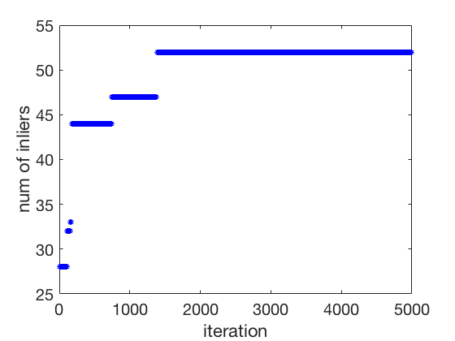

The following two images show the feature points (yellow), putative matches (blue), and inlier matches (green). Note that $$Green \subset Blue \subset Yellow$$

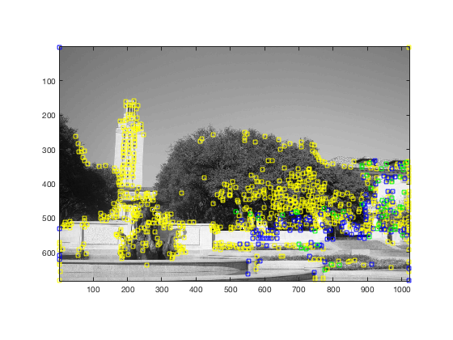

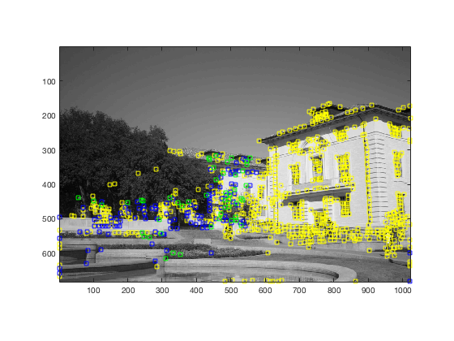

The result of stitching is shown below.

## Part 2
Three sequences of three images each are provided to test image stitching among multiple images. The basic idea is to first run RANSAC between every pair of images to determine the number of inliers to each transformation, use this information to determine which pair of images should be merged first, merge this pair, and proceed recursively.

### `find_stitch_order` function
The essential part of multiple image stitching is the `find_stitch_order` function, which determines the order of merging automatically. 

Say N images are to be stitched. This function first calculate the `inliers_matrix` between any pair of images. This symmetrical NxN matrix has zeros along its diagonal. Then the image with the most total inliers is chosen as the first place in the merging order, e.g. `i`th image. Next, initialize a queue and put all `i`th row elements `(inliers_matrix(i,j),j)` into the queue. The rest of this algorithm is looping and dynamically update the queue until we have assigned every image (above the threshold) an order. In each iteration, the next image in the merging chain is the image with most inliers in the queue (say image `k`). Next, we update the queue by deleting elements `(.,k)` and adding the `k`th row elements `(inliers_matrix(k,j),j)` into the queue if corresponding image `j` has not been merged. Matlab code is attached below. The threshold is tuned to be 30 inliers out of 200 match features.

### Results for Hill sequence
The order of merging for Hill sequence is: `2.JPG -> 1.JPG -> 3.JPG`. The intermediate image and the final stitched image is shown below.

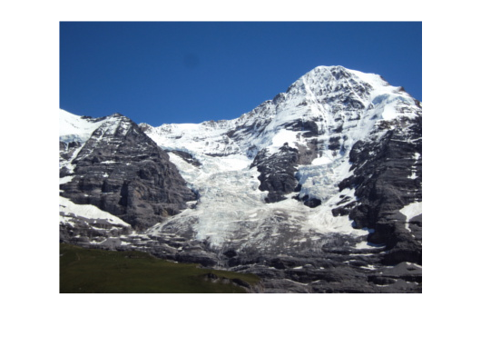

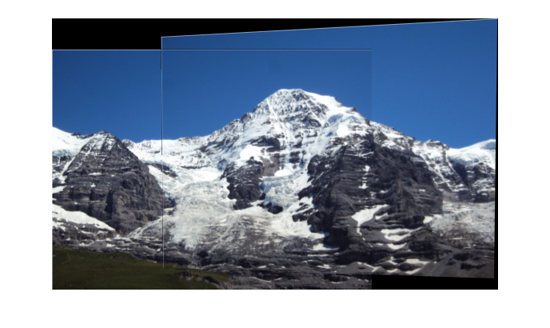

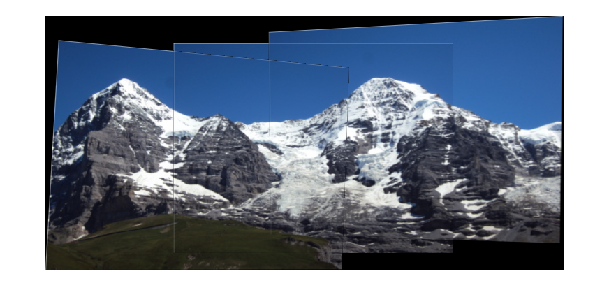

### Results for Ledge sequence
The order of merging for Ledge sequence is: `2.JPG -> 1.JPG -> 3.JPG`. The intermediate image and the final stitched image is shown below.

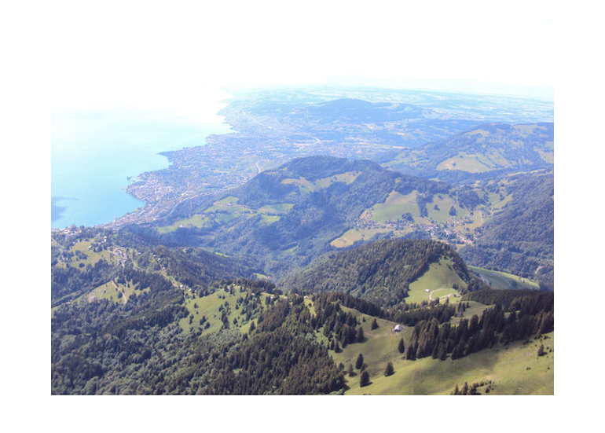

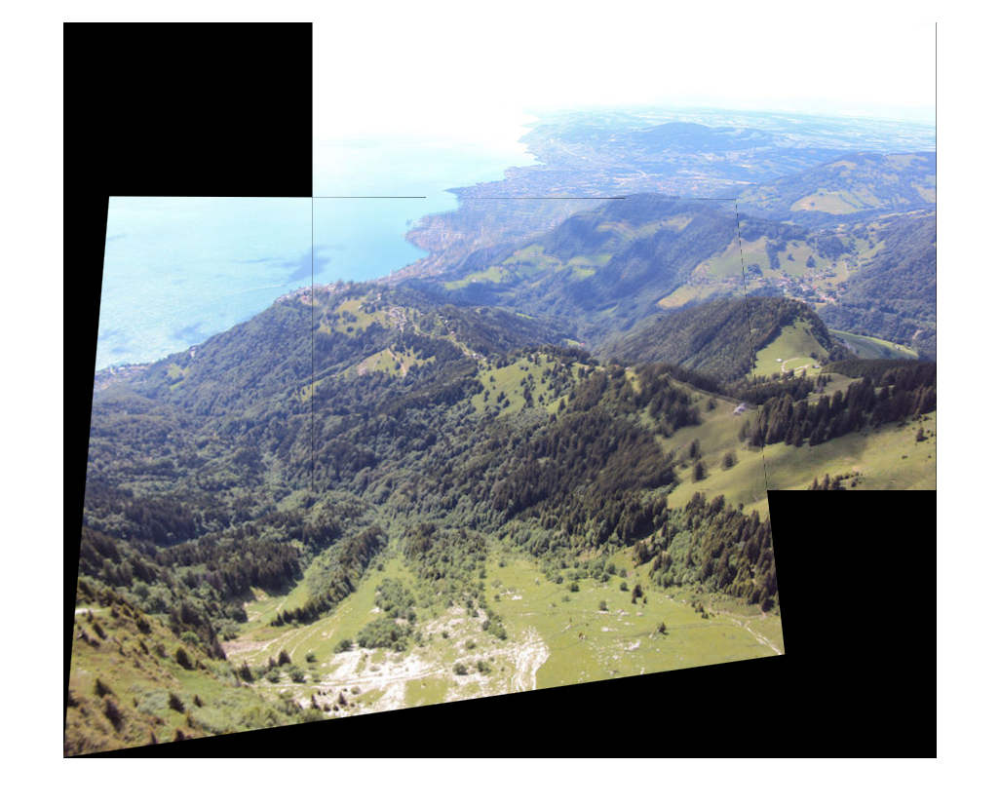

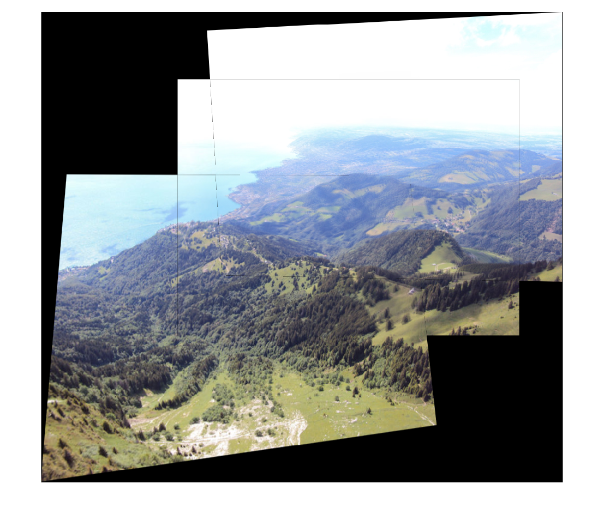

### Results for Pier sequence
The order of merging for Pier sequence is: `2.JPG -> 3.JPG -> 1.JPG`. The intermediate image and the final stitched image is shown below.

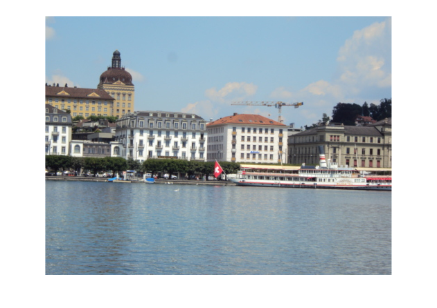

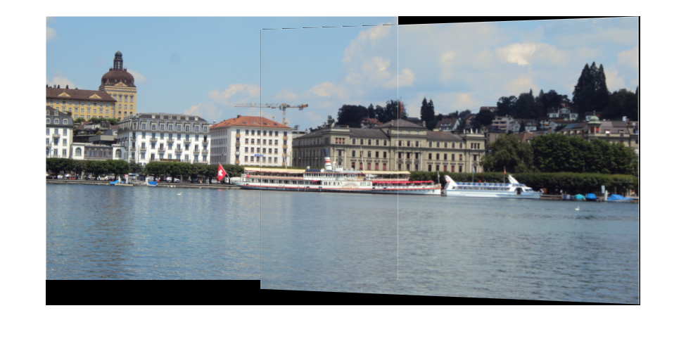

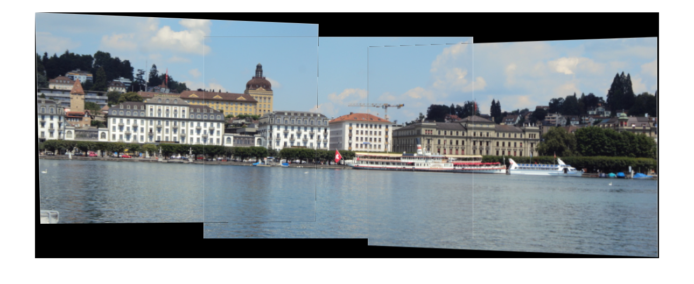

### Results discussion
The Ledge result is blurry in the overlapped region. One possible reason is that even though the transformation is accurately estimated, the interpolation in the `imtransform` function brings error. This erorr is larger with severer distortion, like Ledge sequence. Another reason might come from the moving trees (due to winds?) from the original sequence. The Pier sequence has a border intensity change in the "sky" and "water" region. This might come from the different illumination in two views.

## Extra credits: Now and Then
A modern and a historical view of the same location to mimic the kinds of composites found [here](http://blog.flickr.net/en/2010/01/27/a-look-into-the-past/). A test set is generated from [Sören Weber's work](https://www.boredpanda.com/then-and-now-pictures-changing-world-rephotos/?page_numb=1). Since there are a number of historic buildings with many windows, local neighborhood information is often not enough to distinguish descriptors. These features should be selected carefully by Lowe's ratio test. This test calculates the ratio of closest distance to second-closest distance and reject unreliable matches with ratio larger than a threshold (0.8 is used in this homework.) We can tune the neighborhood window size in the SIFT descriptors. Other possible approaches includes but not limited to Laplacian detector, SURF descriptor. The Lowe's ratio test is implemented in this homework.

### Hofbräuhaus München, Germany, 1910 - 2017

### Chaney Glacier, USA, 1911 - 2005

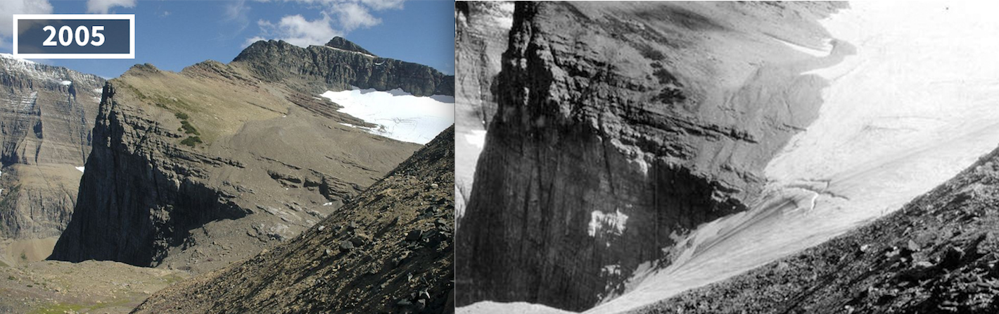

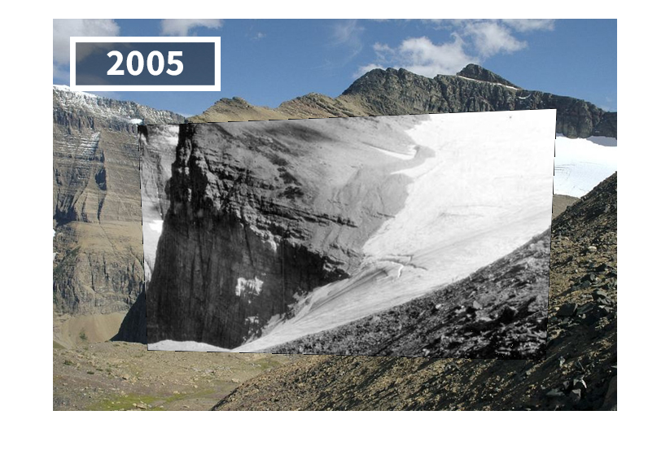

### Tour Eiffel, Paris, France, 1910 - 2016

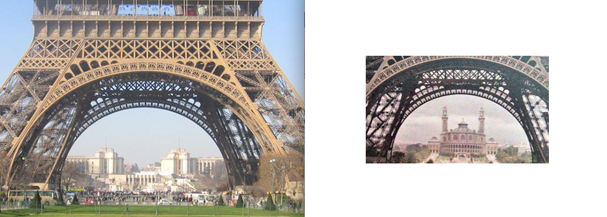

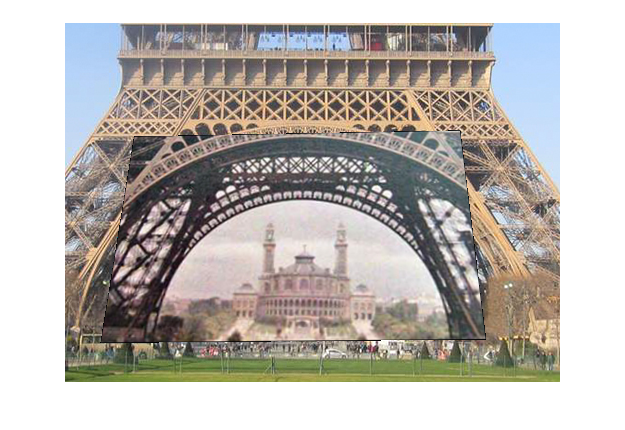

### Paris, France, 1900 - 2017

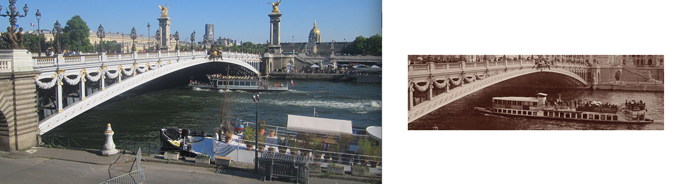

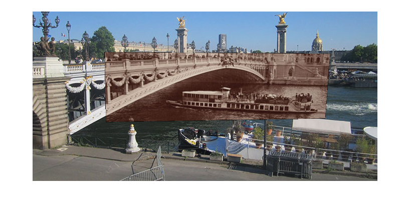

### Łódź, Poland, 1887 - 2015

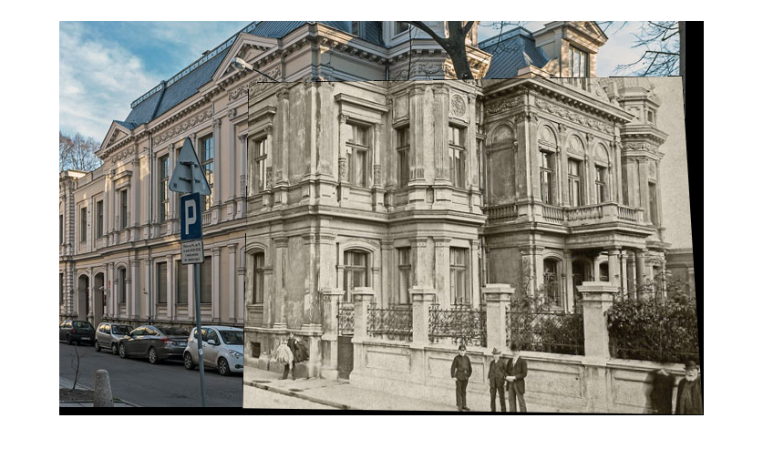

### Römerberg, Frankfurt, Germany, 1910 - 2017

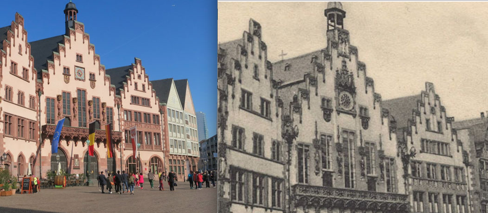

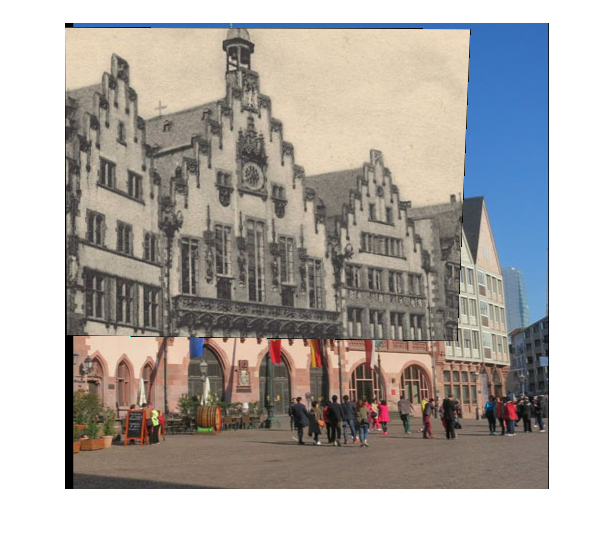

## Extra credits: a Pile of input images
As mentioned above, the `find_stitch_order` function can be used to determine a subset of input images to be stitched by comparing the total number of inliers with the threshold. This function also produces a possible merging order to avoid unreasonble (many outliers) transforms. Five images (input) and thier final stitched image (output) are shown below.

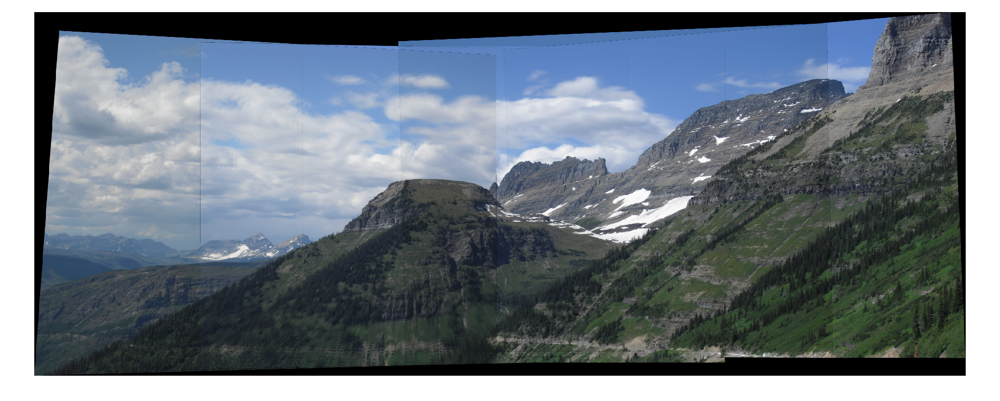
